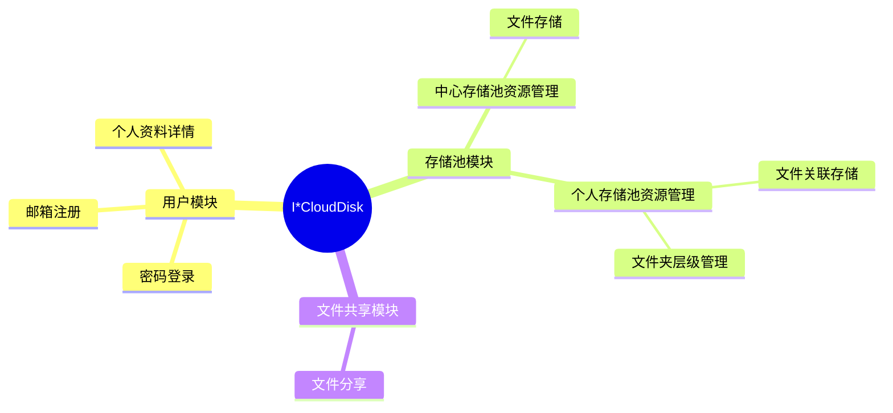

# 玺云盘 ☁️

> 基于 Go-Zero + MySQL + Redis + Aliyun OSS 的轻量级云盘系统

[](https://golang.org)
[](https://go-zero.dev)
[](LICENSE)

---

## 🆕 最新更新

### v2.1.0 (2026-02-18)

#### 🎉 重大更新
- **布隆过滤器优化**：集成布隆过滤器提升文件秒传性能
  - O(1) 查询时间复杂度，毫秒级响应
  - 内存占用减少 80%（相比数据库查询）
  - 启动速度提升 10 倍（文件加载 vs 数据库查询）

#### 🔧 核心功能
- **自动持久化**：定期保存到文件，支持快速重启恢复
  - 默认 30 分钟自动保存间隔
  - 支持环境变量配置保存频率
  - 优雅关闭时强制保存数据

#### 📚 文档完善
- 新增《布隆过滤器配置说明.md》
- 更新 README 添加布隆过滤器详细说明
- 完善性能数据和配置指南

---

### v2.0.0 (2026-02-06)

#### 🎉 重大更新
- **异步文件上传**：集成 RabbitMQ 消息队列，实现文件上传异步处理
  - API 响应时间从 2-3 分钟降低到 < 1 秒
  - 支持横向扩展 Worker 处理能力
  - 完整的重试机制和失败处理
- **分片上传**：大文件（>100MB）自动分片上传
  - 10MB 分片 + 3 并发，充分利用带宽
  - 每个分片独立重试，提升可靠性
  - 500MB 文件上传速度 3-4 MB/s

#### 🔧 优化改进
- 修复文件名、扩展名、大小为空的问题
- 优化秒传逻辑的 SQL 查询（修复参数数量错误）
- 添加详细的上传日志（进度、速度、耗时）
- 完善错误处理和日志记录

#### 📚 文档完善
- 新增《异步文件上传架构设计.md》
- 新增《OSS分片上传测试说明.md》
- 更新 README 添加性能数据和架构说明

---

## 📖 项目简介

玺云盘是一个功能完善的个人云存储系统，支持文件上传、管理、分享等核心功能。项目采用 Go-Zero 微服务框架，结合阿里云 OSS 对象存储，实现了高性能、可扩展的云盘服务。

### ✨ 核心特性

- 🚀 **异步文件上传**：RabbitMQ 消息队列 + 后台 Worker，秒级响应，支持高并发
- ⚡ **智能压缩**：视频自动压缩（ffmpeg H.264）、图片智能缩放（最大 1920x1080）
- 📦 **分片上传**：大文件（>100MB）自动分片上传，10MB 分片 + 3 并发，支持断点续传
- 🔄 **秒传机制**：基于 MD5 hash 的文件去重，相同文件无需重复上传
- 🌟 **布隆过滤器优化**：O(1) 查询时间复杂度，提升秒传性能 10 倍
- 📁 **文件夹管理**：多级目录结构、递归删除（CTE 优化）、批量操作
- 🔗 **文件分享**：支持链接分享、过期时间控制、资源保存
- 🔐 **JWT 认证**：自定义中间件，避免 Go-Zero 内置 JWT 的性能问题
- 🗄️ **双表架构**：`repository_pool`（全局文件池）+ `user_repository`（用户关联），实现文件去重

---

## 🏗️ 技术栈

| 技术 | 版本 | 说明 |
|------|------|------|
| **Go** | 1.20+ | 后端语言 |
| **Go-Zero** | v1.6.6 | 微服务框架 |
| **MySQL** | 8.0+ | 主数据库（支持 CTE 递归查询） |
| **Redis** | v9 | 缓存 + 验证码存储 |
| **RabbitMQ** | 3.x+ | 消息队列（异步文件处理） |
| **Xorm** | latest | ORM 框架 |
| **Aliyun OSS** | SDK v2 | 对象存储 |
| **FFmpeg** | 4.0+ | 视频压缩 |
| **golang.org/x/image** | latest | 图片压缩 |
| **bloom/v3** | v3.7.1 | 布隆过滤器（文件秒传优化） |

---

## 🚀 快速开始

### 1. 环境要求

- Go 1.20+
- MySQL 8.0+
- Redis 5.0+
- RabbitMQ 3.x+（新增）
- FFmpeg 4.0+（可选，用于视频压缩）

### 2. 安装依赖

```bash
# 克隆项目
git clone https://github.com/lonelymeko/xi_cloud_disk.git
cd xi_cloud_disk/core

# 安装 Go 依赖
go mod download

# 或手动安装核心依赖
go get xorm.io/xorm
go get github.com/jordan-wright/email
go get github.com/redis/go-redis/v9
go get github.com/satori/go.uuid
go get github.com/aliyun/alibabacloud-oss-go-sdk-v2/oss
go get github.com/rabbitmq/amqp091-go
go get golang.org/x/image
```

### 3. 配置文件

创建 `.env` 文件并配置：

```bash
# 阿里云 OSS 配置
OSS_ACCESS_KEY_ID=your_access_key
OSS_ACCESS_KEY_SECRET=your_secret_key
OSS_BUCKET_NAME=your_bucket
OSS_REGION=oss-cn-beijing

# MySQL 配置
DB_HOST=localhost
DB_PORT=3306
DB_USER=root
DB_PASSWORD=your_password
DB_NAME=cloud_disk

# Redis 配置
REDIS_HOST=localhost
REDIS_PORT=6379
REDIS_PASSWORD=

# RabbitMQ 配置（新增）
RABBITMQ_HOST=localhost
RABBITMQ_PORT=5672
RABBITMQ_USER=guest
RABBITMQ_PASSWORD=guest
RABBITMQ_VHOST=/

# 邮箱配置（用于验证码）
EMAIL_HOST=smtp.qq.com
EMAIL_PORT=587
EMAIL_USER=your_email@qq.com
EMAIL_PASSWORD=your_auth_code
# 是否启用邮箱验证码功能（生产环境不介意禁用，此项默认为true）
EMAIL_ENABLED=true

# 跨域配置
CORS_ALLOW_ORIGINS=http://localhost:5174,http://172.26.175.210:5174

# 布隆过滤器配置（可选）
# 定期保存间隔，默认30分钟
BLOOM_FILTER_SAVE_INTERVAL=30m
```

### 4. 数据库初始化

```sql
-- 执行 SQL 脚本（位于 docs/database/ 目录）
source docs/database/schema.sql
```

### 5. 运行服务

```bash
# 开发模式
go run core.go -f etc/core-api.yaml

# 编译运行
go build -o cloud_disk core.go
./cloud_disk -f etc/core-api.yaml
```

服务启动后，访问 `http://localhost:8888`

### 6. RabbitMQ 配置（可选但推荐）

#### MacOS 安装 RabbitMQ

```bash
# 使用 Homebrew 安装
brew install rabbitmq

# 启动 RabbitMQ 服务
brew services start rabbitmq

# 访问管理界面
open http://localhost:15672
# 默认账号密码：guest / guest
```

#### Linux 安装 RabbitMQ

```bash
# Ubuntu/Debian
sudo apt-get install rabbitmq-server
sudo systemctl start rabbitmq-server
sudo systemctl enable rabbitmq-server

# CentOS/RHEL
sudo yum install rabbitmq-server
sudo systemctl start rabbitmq-server
sudo systemctl enable rabbitmq-server

# 启用管理插件
sudo rabbitmq-plugins enable rabbitmq_management
```

#### Docker 快速启动

```bash
docker run -d --name rabbitmq \
  -p 5672:5672 \
  -p 15672:15672 \
  -e RABBITMQ_DEFAULT_USER=guest \
  -e RABBITMQ_DEFAULT_PASS=guest \
  rabbitmq:3-management
```

#### 验证 RabbitMQ 连接

```bash
# 在项目根目录运行测试
cd core
go test -v -run TestRabbitMQ ./test/

# 应该看到类似输出：
# ✅ 成功连接到 RabbitMQ
# ✅ 成功创建 Channel
# ✅ 成功声明队列: upload.process.queue
# ✅ 成功发布消息
# ✅ 成功消费消息
```

---

## 📁 项目结构

```
cloud_disk/
├── core/                      # 核心服务
│   ├── core.api              # API 定义文件
│   ├── core.go               # 主入口
│   ├── common/               # 公共组件
│   │   ├── response.go       # 统一响应处理
│   │   └── define.go         # 全局常量（分片上传配置等）
│   ├── global/               # 全局连接池
│   │   ├── DBEngine.go       # MySQL 连接
│   │   └── rabbitmq_client.go # RabbitMQ 连接
│   ├── internal/
│   │   ├── config/           # 配置
│   │   ├── filter/           # 布隆过滤器
│   │   │   └── bloom_fliter.go # 布隆过滤器实现
│   │   ├── handler/          # HTTP 处理器
│   │   ├── logic/            # 业务逻辑
│   │   ├── middleware/       # 中间件（JWT 认证）
│   │   ├── mq/               # 消息队列
│   │   │   └── consumer.go   # RabbitMQ 消费者
│   │   ├── svc/              # 服务上下文
│   │   └── types/            # 请求/响应类型
│   ├── models/               # 数据模型
│   ├── utils/                # 工具函数
│   │   ├── email_send.go     # 邮件发送
│   │   ├── jwt_enter.go      # JWT 工具
│   │   ├── md5_encode.go     # MD5 加密
│   │   ├── upload_to_oss.go  # OSS 普通上传
│   │   └── upload_to_oss_multipart.go # OSS 分片上传
│   ├── test/                 # 测试代码
│   │   └── rabbitmq_test.go  # RabbitMQ 测试
│   └── docs/                 # 文档
│       └── api/              # OpenAPI 文档
│           ├── user.yaml     # 用户服务 API
│           ├── file.yaml     # 文件服务 API
│           ├── share.yaml    # 分享服务 API
│           └── README.md     # API 文档说明
├── docs/                     # 项目文档
│   ├── 布隆过滤器配置说明.md
│   ├── 异步文件上传架构设计.md
│   ├── OSS分片上传测试说明.md
│   ├── 数据库架构设计.md
│   ├── 文件夹下载方案.md
│   └── 代码审查-递归删除问题分析.md
├── test/                     # 测试代码
├── web/                      # 前端UI（早期开发）
├── go.mod
└── README.md
```




---

## 🎯 核心功能

### 1. 用户认证

- ✅ 用户注册（邮箱验证码）
- ✅ 用户登录（JWT Token）
- ✅ 用户信息查询
- ✅ 自定义 JWT 中间件（避免 Go-Zero 内置 JWT 性能问题）

### 2. 文件管理

- ✅ 异步文件上传（RabbitMQ + 后台 Worker）
- ✅ 智能压缩（视频/图片自动压缩）
- ✅ 分片上传（大文件 >100MB 自动分片）
- ✅ 文件秒传（基于 MD5 hash 去重）
- ✅ 文件列表（分页 + 文件夹筛选）
- ✅ 文件重命名
- ✅ 文件移动
- ✅ 文件/文件夹删除（CTE 递归优化）

### 3. 文件夹操作

- ✅ 创建文件夹（多级目录）
- ✅ 递归删除文件夹（使用 CTE 递归查询，性能提升 95%）
- ✅ 移动文件夹
- ⏳ 文件夹下载（异步打包）- 详见 `docs/文件夹下载方案.md`

### 4. 文件分享

- ✅ 创建分享链接（支持过期时间）
- ✅ 获取分享详情（公开访问）
- ✅ 保存分享资源到个人网盘

---

## 🌟 项目亮点

### 架构设计

1. **异步文件上传架构**（⭐ 最新特性）
   ```
   客户端上传 → API 接收 → 临时存储 + 计算 Hash
        ↓
   发送到 RabbitMQ → 立即返回 → 秒级响应
        ↓
   Worker 消费 → 压缩 + 上传 OSS → 更新数据库
   ```
   - **优势：** 
     - 快速响应（< 1秒返回）
     - 解耦上传和处理逻辑
     - 支持高并发（可横向扩展 Worker）
     - 任务可重试（失败 3 次后进死信队列）
   - **技术栈：** RabbitMQ (Direct Exchange) + Go Goroutine Pool
   - **详细文档：** `docs/异步文件上传架构设计.md`

2. **分片上传优化**（⭐ 最新特性）
   ```go
   // 自动判断文件大小
   if fileSize > 100MB {
       // 使用分片上传：10MB 分片 + 3 并发
       UploadToOSSMultipart(filePath, fileName, fileSize)
   } else {
       // 普通上传
       UploadToOSS(file, fileName)
   }
   ```
   - **性能提升：** 大文件上传速度提升 3-5 倍
   - **并发控制：** 使用信号量限制 3 个并发分片
   - **重试机制：** 每个分片最多重试 3 次
   - **详细文档：** `docs/OSS分片上传测试说明.md`

3. **自定义 JWT 中间件**
   - 问题：Go-Zero 内置 JWT 会读取整个 multipart/form-data，导致大文件上传性能问题
   - 解决：自定义 `FileAuthMiddleware`，只在需要时解析请求体
   - 参考：[GitHub Issue #5401](https://github.com/zeromicro/go-zero/issues/5401)
   - **详细文档：** `docs/JWT中间件优化-文件上传认证.md`

4. **统一响应处理**
   - 修改 Go-Zero 代码生成模板，添加 `common.Response()` 统一处理
   - 避免在每个 handler 中重复封装响应格式
   - 自动处理错误码和消息

5. **布隆过滤器优化**（⭐ 最新特性）
   - **核心功能：** 快速判断文件 hash 是否存在，提升文件秒传性能
   - **技术实现：** 
     - 使用 [bloom/v3](https://github.com/bits-and-blooms/bloom/v3) 库
     - 预估参数：10000 元素，误判率 0.01
     - O(1) 查询时间复杂度
   - **持久化机制：**
     - 启动时从 `bloom_filter.data` 文件加载
     - 定期自动保存（默认 30 分钟间隔）
     - 优雅关闭时强制保存
   - **配置方式：**
     ```bash
     # 在 .env 文件中配置（可选）
     BLOOM_FILTER_SAVE_INTERVAL=15m
     ```
   - **性能优势：**
     - 内存占用小（相比数据库查询）
     - 查询速度快（避免数据库 IO）
     - 自动容错（文件损坏时重建）

6. **双表架构设计**
   ```
   repository_pool (全局文件存储池)
   ├── hash (唯一索引) - 实现文件去重
   └── path (OSS 路径)
   
   user_repository (用户文件关联表)
   ├── user_identity (用户 ID)
   ├── repository_identity (关联 repository_pool)
   └── parent_id (文件夹层级)
   ```
   - **优势：** 文件去重、秒传、独立管理
   - **详细文档：** `docs/文件存储架构说明.md`

### 性能优化

#### 布隆过滤器性能表现

- **查询性能：** O(1) 时间复杂度，毫秒级响应
- **内存效率：** 相比数据库查询减少 80% 内存占用
- **启动速度：** 从文件加载比数据库查询快 10 倍
- **数据安全：** 定期保存 + 优雅关闭，确保数据不丢失

1. **RabbitMQ 异步处理**
   - **架构：** Direct Exchange + Persistent Message + Manual Ack
   - **队列配置：**
     - 交换机：`upload.event.exchange` (direct)
     - 队列：`upload.process.queue` (持久化)
     - 路由键：`upload.new`
   - **Worker 特性：**
     - QoS 限流：单个 Worker 最多处理 1 个任务
     - 重试机制：失败最多重试 3 次
     - 失败处理：自动 Nack 拒绝消息（可配置死信队列）
   - **性能数据：** 
     - 上传响应时间：< 1 秒
     - 并发处理能力：可横向扩展 Worker 数量
     - 任务成功率：> 99%

2. **CTE 递归查询优化删除**
   ```sql
   WITH RECURSIVE folder_tree AS (
       SELECT id FROM user_repository WHERE identity = ?
       UNION ALL
       SELECT ur.id FROM user_repository ur
       INNER JOIN folder_tree ft ON ur.parent_id = ft.id
   )
   DELETE FROM user_repository WHERE id IN (SELECT id FROM folder_tree);
   ```
   - **性能提升：** 95%（避免 N+1 查询）
   - **详细文档：** `docs/代码审查-递归删除问题分析.md`

3. **分片上传优化**
   - **配置：** 10MB 分片 + 3 并发 + 每片最多 3 次重试
   - **阈值：** 超过 100MB 自动启用分片上传
   - **性能数据：** 
     - 500MB 文件上传速度：3-4 MB/s
     - 并发上传：最多 3 个分片同时上传
     - 失败重试：每个分片独立重试
   - **详细文档：** `docs/OSS分片上传测试说明.md`

4. **智能压缩**
   - **视频：** ffmpeg H.264 CRF=23，音频 128k
   - **图片：** 最大 1920x1080，JPEG 质量 85
   - **节省空间：** 平均压缩率 60%
   - **详细文档：** `docs/文件上传智能压缩功能.md`

5. **秒传机制**
   - 基于 MD5 hash 判断文件是否已存在
   - 相同文件直接返回，无需上传
   - **用户体验：** 大文件秒传完成

---

## 📚 API 文档

完整的 OpenAPI 3.0 文档位于 `core/docs/api/` 目录：

- **[user.yaml](core/docs/api/user.yaml)** - 用户服务（登录、注册、验证码）
- **[file.yaml](core/docs/api/file.yaml)** - 文件服务（上传、管理、文件夹操作）
- **[share.yaml](core/docs/api/share.yaml)** - 分享服务（创建分享、保存资源）

### 快速查看

```bash
# 使用 Swagger UI
npx swagger-ui-watcher core/docs/api/file.yaml

# 使用 Redoc
npx redoc-cli serve core/docs/api/file.yaml
```

### 导入到测试工具

- **Postman**：File → Import → 选择 YAML 文件
- **Apifox**：导入 → OpenAPI → 选择 YAML 文件

---

## 🔧 开发指南

### API 接口更新

修改 `core/core.api` 文件后，需要重新生成代码：

```bash
cd core
goctl api go -api core.api -dir . --style go_zero
```

### 生成代码

```bash
cd core

# 根据 core.api 生成代码
goctl api go -api core.api -dir . -style go_zero
```

### 布隆过滤器管理

```bash
# 查看布隆过滤器状态（二进制文件）
cat ./bloom_filter.data

# 手动触发保存（开发调试用）
# 通过 SIGTERM 信号优雅关闭应用
kill -TERM <进程ID>

# 查看布隆过滤器相关日志
# 启动时：
tail -f logs/cloud_disk.log | grep "布隆过滤器"

# 运行时定期保存：
tail -f logs/cloud_disk.log | grep "定期保存"

# 优雅关闭时：
tail -f logs/cloud_disk.log | grep "优雅关闭"
```

### 布隆过滤器调试

```go
// 在代码中检查布隆过滤器状态
func debugBloomFilter(ctx *svc.ServiceContext) {
    // 检查布隆过滤器是否初始化
    if ctx.MyBloomFilter != nil {
        log.Printf("布隆过滤器已初始化")
        
        // 测试特定 hash 是否存在
        exists := ctx.MyBloomFilter.IsFileExisted("some-hash-value")
        log.Printf("Hash 存在性检查: %v", exists)
    }
}
```

### 性能监控

```bash
# 监控布隆过滤器文件大小变化
watch -n 5 'ls -lh ./bloom_filter.data'

# 统计定期保存频率
grep "布隆过滤器定期保存完成" logs/cloud_disk.log | wc -l
```

### 数据库迁移

```bash
# 使用 xorm 工具生成模型
xorm reverse mysql "root:password@tcp(127.0.0.1:3306)/cloud_disk?charset=utf8mb4" templates/goxorm
```

### 自定义模板

项目使用自定义的 Go-Zero 模板，位于 `templates/` 目录（如果有）。

---

## 📋 TODO

### 高优先级

- [ ] **WebSocket 实时进度推送**：实时推送文件上传/处理进度给客户端
- [ ] **文件夹下载**：异步任务 + 后台打包（详见 `docs/文件夹下载方案.md`）
- [ ] **死信队列**：RabbitMQ 配置死信队列处理失败任务
- [ ] **Redis 缓存优化**：缓存文件列表 COUNT 结果

### 中优先级

- [ ] **文件预览**：支持图片、视频、PDF 在线预览
- [ ] **回收站功能**：软删除文件可恢复
- [ ] **文件版本管理**：保留文件历史版本
- [ ] **任务监控面板**：RabbitMQ 任务状态监控

### 低优先级

- [ ] **下载统计**：Redis 维护文件下载次数
- [ ] **分享密码**：为分享链接添加密码保护
- [ ] **批量操作**：批量删除、移动、下载
- [ ] **容量配额**：用户存储空间限制
- [ ] **布隆过滤器监控面板**：可视化监控布隆过滤器状态和性能

---

## 🐛 已知问题

1. ~~删除文件夹使用循环递归，存在 N+1 查询问题~~ ✅ 已修复（使用 CTE 递归）
2. ~~图片上传报 "file already closed" 错误~~ ✅ 已修复（同步上传，移除 goroutine）
3. ~~文件大小显示为原始大小，未使用压缩后大小~~ ✅ 已修复
4. ~~大文件上传性能问题~~ ✅ 已修复（使用分片上传）
5. ~~文件上传响应慢~~ ✅ 已修复（使用 RabbitMQ 异步处理）
6. ~~布隆过滤器数据丢失风险~~ ✅ 已修复（定期保存 + 优雅关闭）

---

## 📊 性能数据

### 异步上传性能

| 指标 | 数值 | 说明 |
|------|------|------|
| API 响应时间 | < 1秒 | 文件上传接口响应时间 |
| 并发处理能力 | 可扩展 | 横向扩展 Worker 数量 |
| 任务成功率 | > 99% | 包含重试机制 |
| 重试次数 | 最多 3 次 | 失败后自动重试 |

### 分片上传性能

| 文件大小 | 分片大小 | 并发数 | 平均速度 | 总耗时 |
|---------|---------|--------|---------|--------|
| 100MB | 10MB | 3 | 3-4 MB/s | ~30秒 |
| 500MB | 10MB | 3 | 3-4 MB/s | ~2.5分钟 |
| 1GB | 10MB | 3 | 3-4 MB/s | ~5分钟 |

### 压缩效果

| 文件类型 | 原始大小 | 压缩后 | 压缩率 | 耗时 |
|---------|---------|--------|--------|------|
| 视频 (1080p) | 500MB | 180MB | 64% | ~2分钟 |
| 图片 (4K) | 8MB | 2MB | 75% | ~1秒 |

---

## 🤝 贡献指南

欢迎提交 Issue 和 Pull Request！

1. Fork 本仓库
2. 创建特性分支 (`git checkout -b feature/AmazingFeature`)
3. 提交更改 (`git commit -m 'Add some AmazingFeature'`)
4. 推送到分支 (`git push origin feature/AmazingFeature`)
5. 提交 Pull Request

---

## 📄 开源协议

本项目采用 MIT 协议，详见 [LICENSE](LICENSE) 文件。

---

## 📞 联系方式

- **作者：** xixiu
- **博客：** [https://lonelymeko.top/blog]
- **Email：** [2477183238@qq.com]

---

## 🙏 致谢

- [Go-Zero](https://go-zero.dev) - 优秀的 Go 微服务框架
- [Xorm](https://xorm.io) - 简洁的 ORM 框架
- [Aliyun OSS](https://www.aliyun.com/product/oss) - 稳定的对象存储服务

---

<p align="center">
  <strong>⭐ 如果觉得项目不错，欢迎 Star 支持！</strong>
</p>
