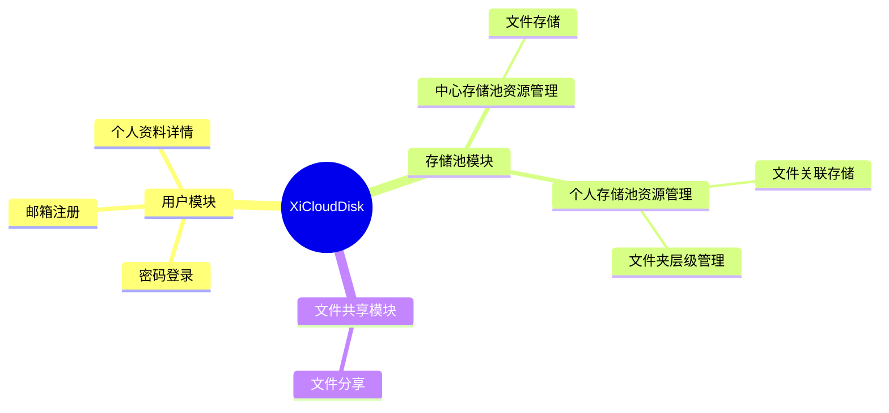

# Cloud Disk API 文档

本目录包含云盘系统的完整 API 文档，采用 OpenAPI 3.0 规范编写。

统一响应包裹：所有接口返回结构 {code,msg,data}

## 📁 文档结构

```
docs/api/
├── README.md        # 本文件 - API 文档说明
├── user.yaml        # 用户服务 API（登录、注册、用户信息等）
├── file.yaml        # 文件服务 API（上传、下载、文件管理等）
└── share.yaml       # 分享服务 API（文件分享、保存资源等）
```

## 📚 API 模块说明

### 1. 用户服务 (`user.yaml`)

**Base URL:** `http://127.0.0.1:8888/api/users`

**功能：** 用户账号相关操作

**接口列表：**
- `POST /login` - 用户登录
- `POST /register` - 用户注册
- `POST /detail` - 获取用户详情
- `POST /send-verification-code` - 发送邮箱验证码

**认证：** 大部分接口需要 JWT token

---

### 2. 文件服务 (`file.yaml`)

**Base URL:** `http://127.0.0.1:8888/api/file`

**功能：** 文件上传、管理、文件夹操作

**接口列表：**
- `POST /upload` - 文件上传（异步入队，支持智能压缩和秒传）
- `POST /user/repository` - 创建用户文件关联
- `POST /user/list` - 获取文件列表（分页）
- `POST /user/file/name/update` - 重命名文件
- `POST /user/folder/create` - 创建文件夹
- `POST /user/folder/delete` - 删除文件或文件夹（递归）
- `PUT /user/file/move` - 移动文件或文件夹

**认证：** 所有接口都需要 JWT token

**特色功能：**
- **智能压缩：** 视频（ffmpeg H.264）、图片（最大 1920x1080，质量 85）
- **秒传机制：** 基于 MD5 hash 的文件去重
- **递归删除：** 使用 CTE 递归查询，性能优化
- **双表架构：** `repository_pool`（全局文件池）+ `user_repository`（用户关联）

---

### 3. 分享服务 (`share.yaml`)

**Base URL:** `http://127.0.0.1:8888/api/share`

**功能：** 文件分享和资源保存

**接口列表：**
- `POST /create` - 创建分享记录（生成分享链接）
- `GET /get` - 获取分享详情（**公开接口，无需认证**）
- `POST /save` - 保存分享的资源到自己的网盘

**认证：** 
- `/get` 接口无需 token（公开访问）
- 其他接口需要 JWT token

**分享规则：**
- 支持设置过期时间（秒为单位）
- 过期后链接失效
- 保存的文件不占用额外存储（文件去重）

---

## 🔐 认证说明

### JWT Token 认证

大部分接口需要在 HTTP Header 中携带 JWT token：

```http
Authorization: Bearer <your_token>
```

### 获取 Token

通过以下接口获取 token：
1. **登录：** `POST /api/users/login`
2. **注册：** `POST /api/users/register`

### 公开接口（无需认证）

- `GET /api/share/get` - 获取分享详情

---

## 📖 使用指南

### 1. 在线查看

使用 Swagger UI 或 Redoc 查看：

```bash
# 使用 Swagger UI
npx swagger-ui-watcher user.yaml

# 使用 Redoc
npx redoc-cli serve file.yaml
```

### 2. 导入到 API 测试工具

支持的工具：
- **Postman**：File → Import → 选择 YAML 文件
- **Apifox**：导入 → OpenAPI → 选择 YAML 文件
- **Insomnia**：Import/Export → Import Data → 选择 YAML 文件

### 3. 生成客户端代码

使用 OpenAPI Generator 生成各种语言的客户端：

```bash
# 安装 OpenAPI Generator
npm install @openapitools/openapi-generator-cli -g

# 生成 TypeScript/JavaScript 客户端
openapi-generator-cli generate -i file.yaml -g typescript-axios -o ./client/typescript

# 生成 Python 客户端
openapi-generator-cli generate -i file.yaml -g python -o ./client/python

# 生成 Go 客户端
openapi-generator-cli generate -i file.yaml -g go -o ./client/go
```

---

## 🏗️ 数据库架构

### 核心表结构

1. **`user_basic`** - 用户基本信息
   - identity (PK)
   - name
   - email
   - password

2. **`repository_pool`** - 全局文件存储池
   - identity (PK)
   - hash (唯一索引)
   - name
   - ext
   - size
   - path (OSS 路径)

3. **`user_repository`** - 用户文件关联表
   - id (PK)
   - identity (唯一索引)
   - user_identity (FK → user_basic)
   - parent_id (自关联，文件夹层级)
   - repository_identity (FK → repository_pool)
   - name
   - ext

4. **`share_basic`** - 分享记录表
   - identity (PK)
   - user_identity (FK → user_basic)
   - repository_identity (FK → repository_pool)
   - expired_time

### 架构优势

- ✅ **文件去重：** 相同文件只存储一次
- ✅ **秒传支持：** 基于 hash 判断文件是否存在
- ✅ **独立管理：** 每个用户可以独立重命名、删除文件
- ✅ **空间节省：** 多用户共享同一文件不占用额外空间

---

## 📝 更新日志

### v1.0.0 (2026-02-05)

**新增功能：**
- ✅ 完整的用户认证系统（登录、注册、验证码）
- ✅ 文件上传（智能压缩、秒传）
- ✅ 文件管理（列表、重命名、删除、移动）
- ✅ 文件夹操作（创建、删除、移动）
- ✅ 文件分享系统（创建分享、获取分享、保存资源）

**性能优化：**
- ✅ CTE 递归查询优化文件夹删除（性能提升 95%）
- ✅ 视频压缩（ffmpeg H.264 CRF 23）
- ✅ 图片压缩（最大 1920x1080，质量 85）
- ✅ 文件去重（基于 MD5 hash）

**数据库：**
- ✅ 双表架构设计
- ✅ 软删除支持（deleted_at 字段）
- ✅ 文件夹层级结构（parent_id 自关联）

---

## 🔧 开发建议

### API 设计原则

1. **RESTful 风格：** 使用标准 HTTP 方法（GET、POST、PUT、DELETE）
2. **统一响应格式：** 所有接口返回 JSON 格式
3. **错误处理：** 使用标准 HTTP 状态码
4. **分页支持：** 列表接口支持 page 和 size 参数
5. **安全认证：** 敏感操作需要 JWT token

### 最佳实践

1. **文件上传：** 先上传文件获取 identity，再调用 `/user/repository` 关联到用户
2. **文件列表：** 使用分页查询，避免一次性加载大量数据
3. **删除操作：** 删除文件夹前提示用户（包含所有子项）
4. **分享链接：** 设置合理的过期时间，避免永久分享
5. **错误重试：** 网络错误时实现指数退避重试机制

---

## 📞 联系方式

如有问题或建议，请联系开发团队。

---

**文档版本：** v1.0.0  
**最后更新：** 2026-02-05  
**维护者：** Cloud Disk Team


